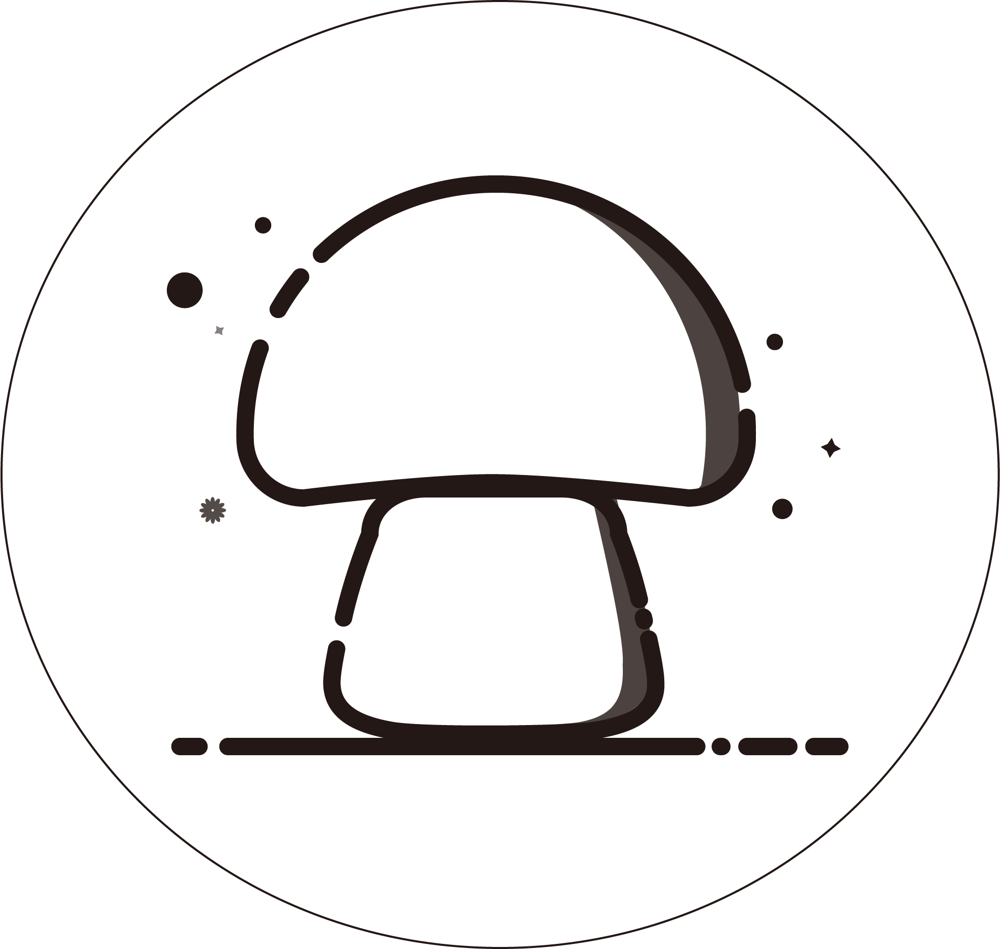

# 📙Daniel的学习笔记

- Damiel的学习笔记~
<!--
<a href='https://gitee.com/moxi159753/LearningNotes/stargazers'></img></a>
<a href='https://gitee.com/moxi159753/LearningNotes/members'></img></a>-->

:rocket: 本站访问数：次 
:rocket: 

 <!--[Gitee](<https://gitee.com/moxi159753/LearningNotes>)
[Github](<https://github.com/moxi624/LearningNotes>)-->
[开始阅读](README.md)

